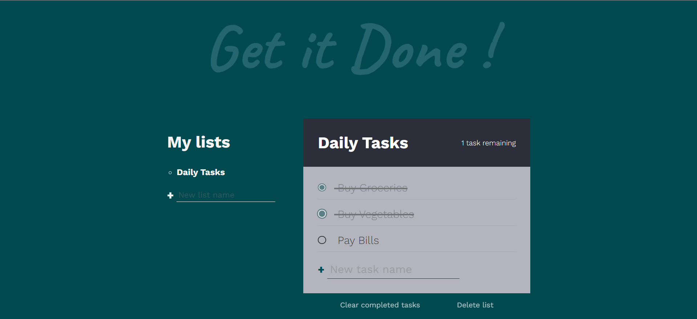
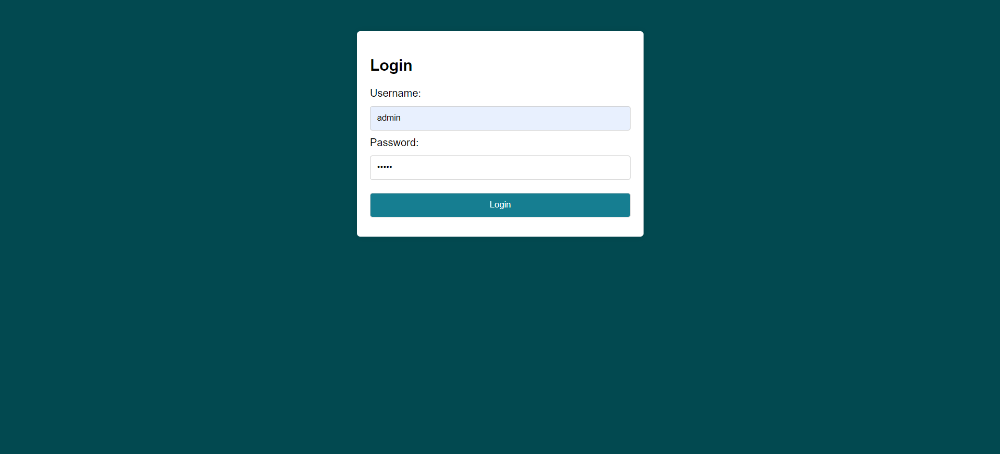

<!DOCTYPE html>
<html lang="en">
<head>
  <meta charset="UTF-8">
  <meta name="viewport" content="width=device-width, initial-scale=1.0">
</head>
<body>
  <h1>Todo List</h1>
  
This is a simple <a href="https://mohitmonk.github.io/ToDo-Application/login.html"> ToDo list application.</a>

  <h2>Getting Started</h2>
  
To get started, simply clone this repository and open the <code>index.html</code> file in your web browser.

  <h2>Features</h2>
  <ul>
    <li>Create multiple task lists</li>
    <li>Add tasks to each list</li>
    <li>Mark tasks as completed</li>
    <li>Delete completed tasks</li>
    <li>Delete task lists</li>
  </ul>
  <h2>Usage</h2>
  <ol>
    <li><strong>Create a new list:</strong>
      <ul>
        <li>Enter the name of the new list in the input field.</li>
        <li>Click on the "+" button to create the list.</li>
      </ul>
    </li>
    <li><strong>Add tasks to a list:</strong>
      <ul>
        <li>Click on a list title to select it.</li>
        <li>Enter the task name in the input field below the list.</li>
        <li>Click on the "+" button to add the task to the list.</li>
      </ul>
    </li>
    <li><strong>Mark tasks as completed:</strong>
      <ul>
        <li>Click on the checkbox next to the task to mark it as completed.</li>
      </ul>
    </li>
    <li><strong>Delete completed tasks:</strong>
      <ul>
        <li>Click on the "Clear completed tasks" button to remove all completed tasks from the list.</li>
      </ul>
    </li>
    <li><strong>Delete a list:</strong>
      <ul>
        <li>Click on the "Delete list" button to delete the entire list.</li>
      </ul>
    </li>
  </ol>
<h2>Screenshots</h2>
</img>
</img>
 
  <h2>Built With</h2>
  <ul>
    <li>HTML</li>
    <li>CSS</li>
    <li>JavaScript</li>
  </ul>
  <h2>License</h2>
  
This project is licensed under the MIT License - see the <code>LICENSE</code> file for details.

</body>
</html>
